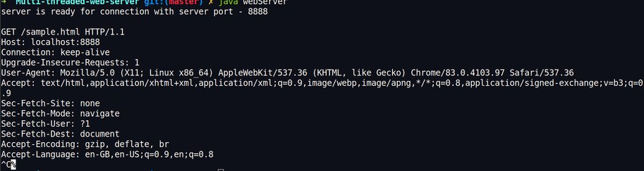
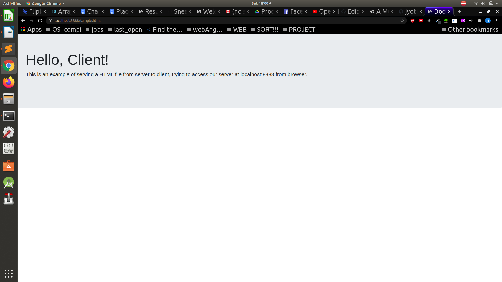

# Multi-threaded-web-server
Designed to practice writing client-server socket programs and multithreaded programs.
A Java implementation of Simple HTTP Multithreaded Web Server. 

[//]: # (Part1 : socket code [server,client], Part 2: Simplistic Single-Threaded Web Server, Part 3: Simplistic Multithreaded Web Server, Part 4: Better Multi-Threaded Web Server that Handles More HTTP )

### Development Tools:
1. **Programming Language** : Java (jdk 1.7)
2. **External Packages** : No external packages are required other than default Java packages like java.io and java.net.
3. **OS** : Ubuntu (18.04 LTS) by Linux
4. **Command Line Interface** : Ubuntu terminal to run/test the program

### Testing Commands(in terminal):
1. Clear previously compiled files using\
  `$ rm *.class`

2. Compile all server and client code located in separate directories.\
`$ cd server`\
`$ javac *.java`\
`$ cd ../client`\
`$ javac *.java`

    *But as we have not created separate directories and are only dealing with server , compile the server code*\
    `$ javac WebServer.java`\
    *The location for the files to be served should be specified on the command line when running the server or files should be saved in server directory only*

3. Run web server in server directory. If no port is passed, a default 8888 port is used. If port is already in use, a proper error message is displayed.
    - Default port 8888 will be used if following command is run\
    `$ java WebServer`
    
    - Given port will be used if following command is run\
    `$ java WebServer 12345`
    
[//]: # (The location for the files to be served should be specified on the command line when running the server, so testing can be done by running the server, using commands :
$ java WebServer rootDir)

### Making Get requests as Client :
We should then be able to start a browser on the same computer, visit `localhost:8888/sample.html` or `localhost:8888/sampleImage.jpg`

There are other many ways of testing your web server : **telnet** server port_num, then type in a GET command (make sure to enter a blank line after the GET command).\

  `$ telnet localhost 8888`\
  `GET /sample.html HTTP/1.0`
  
  *telnet will exit when it detects that your web server has closed its end of the socket (or you can kill it with ctrl-C, or if that doesn't work use kill or killall: `killall telnet.`*

### Output :
1. **terminal**

2. **browser**

### References :
https://www.cs.carleton.edu/faculty/dmusican/cs348/webserver.html
  
